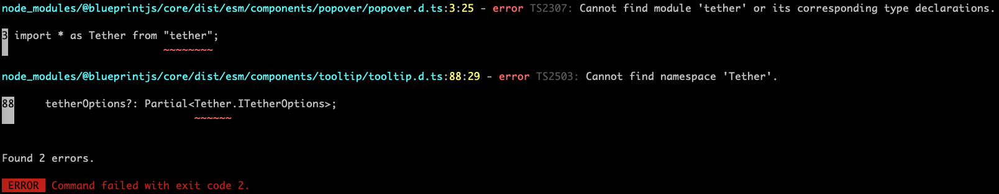

# ts-paths-symlink-repro

Repro for a potential issue with TypeScript path resolutions & symlinks.


## Yarn
```
git clean -dfx && yarn
cd packages/foo-app && yarn run build
```

Here's how @blueprintjs/core is resolved by TypeScript:

```
======== Resolving module '@blueprintjs/core' from '/Volumes/git/walkerburgin/ts-paths-repro/packages/foo-app/src/FooApp.tsx'. ========
Explicitly specified module resolution kind: 'NodeJs'.
'baseUrl' option is set to '/Volumes/git/walkerburgin/ts-paths-repro/packages/foo-app/src', using this value to resolve non-relative module name '@blueprintjs/core'.
'paths' option is specified, looking for a pattern to match module name '@blueprintjs/core'.
Module name '@blueprintjs/core', matched pattern '@blueprintjs/core'.
Trying substitution '../node_modules/@blueprintjs/core', candidate module location: '../node_modules/@blueprintjs/core'.
Loading module as file / folder, candidate module location '/Volumes/git/walkerburgin/ts-paths-repro/packages/foo-app/node_modules/@blueprintjs/core', target file type 'TypeScript'.
Loading module '@blueprintjs/core' from 'node_modules' folder, target file type 'TypeScript'.
Directory '/Volumes/git/walkerburgin/ts-paths-repro/packages/foo-app/src/node_modules' does not exist, skipping all lookups in it.
Scoped package detected, looking in 'blueprintjs__core'
Directory '/Volumes/git/walkerburgin/ts-paths-repro/packages/foo-app/node_modules' does not exist, skipping all lookups in it.
Scoped package detected, looking in 'blueprintjs__core'
Directory '/Volumes/git/walkerburgin/ts-paths-repro/packages/node_modules' does not exist, skipping all lookups in it.
Scoped package detected, looking in 'blueprintjs__core'
Found 'package.json' at '/Volumes/git/walkerburgin/ts-paths-repro/node_modules/@blueprintjs/core/package.json'.
'package.json' does not have a 'typesVersions' field.
File '/Volumes/git/walkerburgin/ts-paths-repro/node_modules/@blueprintjs/core.ts' does not exist.
File '/Volumes/git/walkerburgin/ts-paths-repro/node_modules/@blueprintjs/core.tsx' does not exist.
File '/Volumes/git/walkerburgin/ts-paths-repro/node_modules/@blueprintjs/core.d.ts' does not exist.
'package.json' has 'typings' field 'dist/esm/index.d.ts' that references '/Volumes/git/walkerburgin/ts-paths-repro/node_modules/@blueprintjs/core/dist/esm/index.d.ts'.
File '/Volumes/git/walkerburgin/ts-paths-repro/node_modules/@blueprintjs/core/dist/esm/index.d.ts' exist - use it as a name resolution result.
Resolving real path for '/Volumes/git/walkerburgin/ts-paths-repro/node_modules/@blueprintjs/core/dist/esm/index.d.ts', result '/Volumes/git/walkerburgin/ts-paths-repro/node_modules/@blueprintjs/core/dist/esm/index.d.ts'.
======== Module name '@blueprintjs/core' was successfully resolved to '/Volumes/git/walkerburgin/ts-paths-repro/node_modules/@blueprintjs/core/dist/esm/index.d.ts' with Package ID '@blueprintjs/core/dist/esm/index.d.ts@1.40.0'. ========
```

## PNPM
```
git clean -dfx && pnpm install
cd packages/foo-app && pnpm run build
```

Here's how @blueprintjs/core is resolved by TypeScript:

```
======== Resolving module '@blueprintjs/core' from '/Volumes/git/walkerburgin/ts-paths-repro/packages/foo-app/src/FooApp.tsx'. ========
Explicitly specified module resolution kind: 'NodeJs'.
'baseUrl' option is set to '/Volumes/git/walkerburgin/ts-paths-repro/packages/foo-app/src', using this value to resolve non-relative module name '@blueprintjs/core'.
'paths' option is specified, looking for a pattern to match module name '@blueprintjs/core'.
Module name '@blueprintjs/core', matched pattern '@blueprintjs/core'.
Trying substitution '../node_modules/@blueprintjs/core', candidate module location: '../node_modules/@blueprintjs/core'.
Loading module as file / folder, candidate module location '/Volumes/git/walkerburgin/ts-paths-repro/packages/foo-app/node_modules/@blueprintjs/core', target file type 'TypeScript'.
File '/Volumes/git/walkerburgin/ts-paths-repro/packages/foo-app/node_modules/@blueprintjs/core.ts' does not exist.
File '/Volumes/git/walkerburgin/ts-paths-repro/packages/foo-app/node_modules/@blueprintjs/core.tsx' does not exist.
File '/Volumes/git/walkerburgin/ts-paths-repro/packages/foo-app/node_modules/@blueprintjs/core.d.ts' does not exist.
Found 'package.json' at '/Volumes/git/walkerburgin/ts-paths-repro/packages/foo-app/node_modules/@blueprintjs/core/package.json'.
'package.json' does not have a 'typesVersions' field.
'package.json' has 'typings' field 'dist/esm/index.d.ts' that references '/Volumes/git/walkerburgin/ts-paths-repro/packages/foo-app/node_modules/@blueprintjs/core/dist/esm/index.d.ts'.
File '/Volumes/git/walkerburgin/ts-paths-repro/packages/foo-app/node_modules/@blueprintjs/core/dist/esm/index.d.ts' exist - use it as a name resolution result.
======== Module name '@blueprintjs/core' was successfully resolved to '/Volumes/git/walkerburgin/ts-paths-repro/packages/foo-app/node_modules/@blueprintjs/core/dist/esm/index.d.ts' with Package ID '@blueprintjs/core/dist/esm/index.d.ts@1.40.0'. ========
```

And here's the compilation error:



Here's what you get if you remove the `"paths"` from `tsconfig.json`: 

```
======== Resolving module '@blueprintjs/core' from '/Volumes/git/walkerburgin/ts-paths-repro/packages/foo-app/src/FooApp.tsx'. ========
Explicitly specified module resolution kind: 'NodeJs'.
Loading module '@blueprintjs/core' from 'node_modules' folder, target file type 'TypeScript'.
Directory '/Volumes/git/walkerburgin/ts-paths-repro/packages/foo-app/src/node_modules' does not exist, skipping all lookups in it.
Scoped package detected, looking in 'blueprintjs__core'
Found 'package.json' at '/Volumes/git/walkerburgin/ts-paths-repro/packages/foo-app/node_modules/@blueprintjs/core/package.json'.
'package.json' does not have a 'typesVersions' field.
File '/Volumes/git/walkerburgin/ts-paths-repro/packages/foo-app/node_modules/@blueprintjs/core.ts' does not exist.
File '/Volumes/git/walkerburgin/ts-paths-repro/packages/foo-app/node_modules/@blueprintjs/core.tsx' does not exist.
File '/Volumes/git/walkerburgin/ts-paths-repro/packages/foo-app/node_modules/@blueprintjs/core.d.ts' does not exist.
'package.json' has 'typings' field 'dist/esm/index.d.ts' that references '/Volumes/git/walkerburgin/ts-paths-repro/packages/foo-app/node_modules/@blueprintjs/core/dist/esm/index.d.ts'.
File '/Volumes/git/walkerburgin/ts-paths-repro/packages/foo-app/node_modules/@blueprintjs/core/dist/esm/index.d.ts' exist - use it as a name resolution result.
Resolving real path for '/Volumes/git/walkerburgin/ts-paths-repro/packages/foo-app/node_modules/@blueprintjs/core/dist/esm/index.d.ts', result '/Volumes/git/walkerburgin/ts-paths-repro/node_modules/.pnpm/@blueprintjs/core@1.40.0_react-dom@16.14.0+react@16.14.0/node_modules/@blueprintjs/core/dist/esm/index.d.ts'.
======== Module name '@blueprintjs/core' was successfully resolved to '/Volumes/git/walkerburgin/ts-paths-repro/node_modules/.pnpm/@blueprintjs/core@1.40.0_react-dom@16.14.0+react@16.14.0/node_modules/@blueprintjs/core/dist/esm/index.d.ts' with Package ID '@blueprintjs/core/dist/esm/index.d.ts@1.40.0'. ========
```

(No compilation errors).

Note that in this case, `@blueprintjs/core` is resolved to the real path in `node_modules/.pnpm` and not the symlinks.
